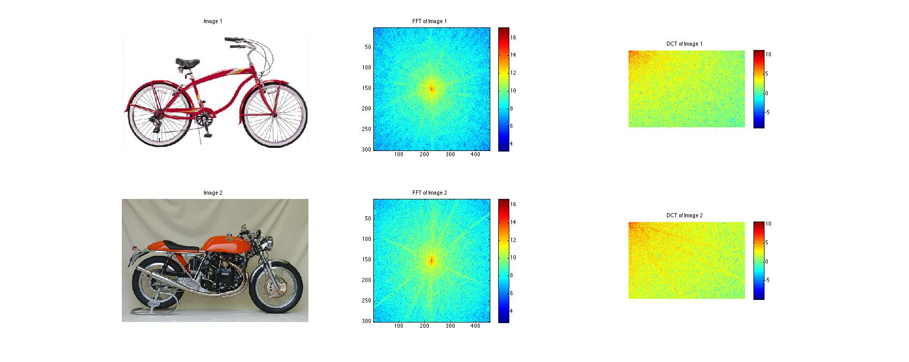
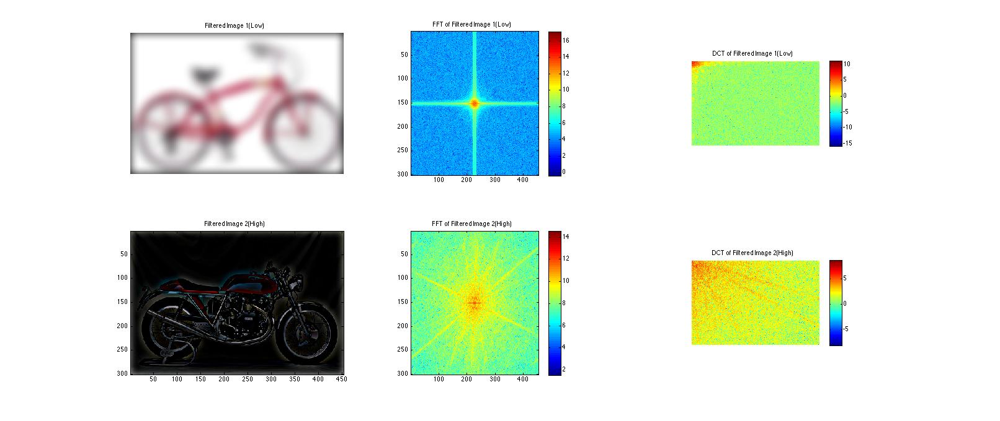

# Hybrid images

## Source

This lab is based on

- http://cs.brown.edu/courses/cs143/proj1/
- https://courses.engr.illinois.edu/cs498dh3/fa2014/projects/hybrid/ComputationalPhotography_ProjectHybrid.html
- http://cvcl.mit.edu/publications/OlivaTorralb_Hybrid_Siggraph06.pdf
- http://cvcl.mit.edu/hybridimage.htm

## Examples

This images look different when viewed from far away (or in a small size), than when looking at them in front of the screen.

## Theory

*Hybrid images* are composed from two images. A low pass filter is applied to the first one and a high pass filter is applied to the other one. From a close distance the high pass filtered imaged dominates, while from a large distance the low pass filreded one does. The effect works best when the images are aligned.

## Exercise

### Choose images

The data folder (originally downloaded from [here](http://cs.brown.edu/courses/cs143/proj1/) ) contains several pairs of images already aligned. Choose one of them, and read both images into matlab.

Imagen 1

Imagen 2

### Filtering

Use [imfilter](http://www.mathworks.com/help/images/ref/imfilter.html) to apply a low pass filter to one image.
For creating the high-pass filtered image, apply a low pass filter to it, and then substract it from the original image. Mathematically: *Y = X - f(X)* , where *X* is the input image and *f* is the low pass filter. Note that this image will contain negative values.

Look at the [fft](http://www.mathworks.com/help/matlab/ref/fft2.html) and [dct](http://www.mathworks.com/help/images/ref/dct2.html) transforms of

- The original images

- The filter 

- The filtered images

### Adding the images

The hybrid image is composed by adding the two filtered images. The full formula would be

*H = f1(X1) + (X2 - f2(X2) )*

Where *f1* and *f2* are low pass filters, and *X1* and *X2* are the input images. Notice that the effect depends on the cut-off frequencies of both filters (see figure 5 of the [Hybrid Images paper](http://cvcl.mit.edu/publications/OlivaTorralb_Hybrid_Siggraph06.pdf)). Additionally, you may scale the amplitude of one of the images to reduce or increase its impact. Play with this parameters to get a good Hybrid Image.

- Upload the full matlab script used to generate the image to the repository
> Uploaded in the folder Matlab Codes as hybridScript

- Upload the final image to the repository

### Visualization

In order to simulate how the image will look from different distances we can use a pyramid (see figure at the bottom of http://cs.brown.edu/courses/cs143/proj1/ ).

- Create such a visualization for your image

- Upload it to the repository

## Homework

Create a hybrid image based on images from your own collections. The more original the better. Some ideas are

- You or people you know
- Pets
- Pictures of the university or the city
- Pictures of places you have visited (preferably in Colombia)
- Use your creativity

Notice that you will have to align the images to increase the effect. To do this you may use image edition software like gimp or photoshop. You are free to do any additional processing that you want in order to increase the effect.

Finally, upload to the repository 

- The original images
- The final hybrid image
- The code you used to blend them

